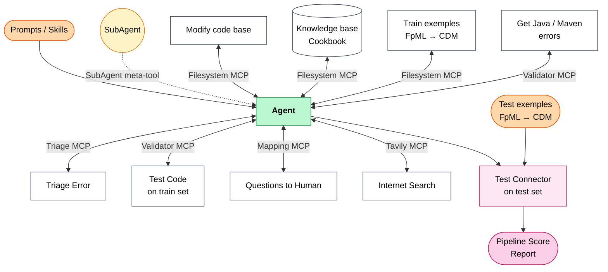
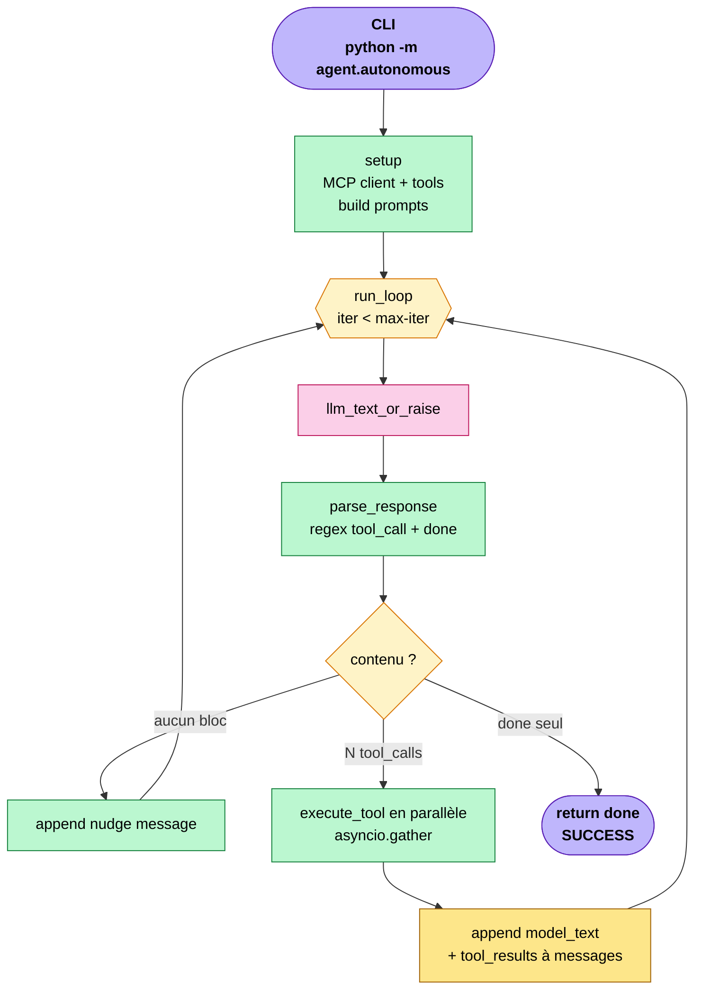
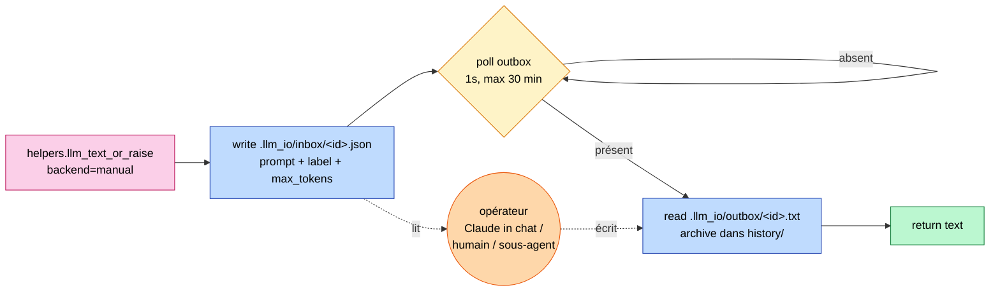

# interface_gen — Agent autonome FpML → CDM

Agent qui génère un convertisseur Java FpML 5.x → CDM 6.x. **Aucun nœud fixe** :
le LLM décide tout — lire les fichiers, écrire le projet Maven, compiler,
tester, patcher — via un protocole de `<tool_call>` XML-tag. Architecture
ReAct simple plus sous-agents parallèles non-récursifs.

Backend par défaut : `manual` — l'« LLM » est Claude répondant dans le chat via
fichiers `.llm_io/inbox/*.json` ↔ `.llm_io/outbox/*.txt`. Aucune clé API,
qualité Claude full. Run prouvé sur `ird-ex08-fra` : **5 itérations → 100 %
(92/92)** match avec le JSON CDM de référence.

Entrée : `agent/autonomous.py`. L'ancien `agent/graph.py` (state machine
LangGraph nodée) est conservé pour historique mais n'est plus utilisé.

---

## Architecture

### Vue d'ensemble : capacités de l'Agent + pipeline d'évaluation



L'agent reçoit ses instructions (Prompts/Skills) et peut se déléguer via
le meta-tool SubAgent. Les capacités sont toutes médiées par des MCP
servers — bidirectionnel parce que chaque outil produit un retour
(`<tool_result>`) que l'agent lit. Le bloc inférieur (Test Connector →
Pipeline Score Report) est le runner batch hors-agent qui mesure le
pass-rate sur le test set.

### Boucle ReAct principale (`agent/autonomous.py`)



Le LLM décide quand s'arrêter en émettant `<done>`. Les tool_calls
en parallèle (un par bloc `<tool_call>` dans la réponse) sont dispatchés
vers les MCP servers OU vers le meta-tool `spawn_subagent` qui ré-entre
dans `run_loop` avec `allow_subagents=False` (récursion bornée à 1 niveau).

### Backend `manual` (l'« LLM » = opérateur externe)



**Légende des couleurs** (commune aux deux diagrammes)

| Couleur | Signification |
|---------|---------------|
| 🟣 Violet | Entrée / sortie (CLI, return done) |
| 🟡 Jaune | Routage conditionnel |
| 🩷 Rose  | Appel LLM (`helpers.llm_text_or_raise`) |
| 🔵 Bleu  | I/O fichier ou MCP |
| 🟢 Vert  | Code Python pur |
| 🟠 Orange| Mutation de l'état (liste `messages`) |
| 🟧 Or    | Acteur externe (opérateur, meta-tool) |

---

## Protocole tool_call

Chaque tour, le modèle émet un texte qui contient :

```
<tool_call>
{"name": "<tool_name>", "args": { ... }}
</tool_call>
```

- Plusieurs `<tool_call>` blocks dans un tour → exécution **parallèle** via `asyncio.gather`.
- Le host renvoie chaque résultat dans `<tool_result name="..." idx="...">...</tool_result>`.
- Pour clore la boucle : `<done>résumé en 1 phrase</done>`.
- Erreurs : `<tool_result ... error="true">message</tool_result>` — le modèle décide quoi faire.

---

## Itération typique (FRA ird-ex08-fra, run end-to-end)

| Step | Tour Python | Tool calls émis | Sortie |
|------|-------------|------------------|--------|
| 1 | Setup + 1er LLM call | `mkdir_p`, `read_file` ×3, `get_maven_dependencies` | exploration |
| 2 | LLM voit FpML + CDM + deps | `write_file` ×4 (pom + 3 Java) | projet Maven écrit via MCP |
| 3 | LLM voit confirmations | `compile_project` | `ok: true` |
| 4 | LLM voit compile vert | `run_test` | `match: true, score: 100.0` |
| 5 | LLM voit match | `<done>...</done>` | SUCCESS |

**5 itérations LLM** pour un FRA — l'agent décide le séquencement.

---

## Backends LLM

Configuré via `LLM_BACKEND` dans `.env`. Tous passent par `helpers.llm_text_or_raise`.

| Backend | URL / mécanisme | Variable modèle | Notes |
|---------|------------------|------------------|-------|
| `gemini` | `generativelanguage.googleapis.com/v1beta/openai/` | `GEMINI_MODEL` | Free tier capricieux : 20 RPD sur 2.5-flash, 0 sur 2.0-flash dans certains projets |
| `groq`   | `api.groq.com/openai/v1` | `GROQ_MODEL` | Free : ~100k TPD sur llama-3.3-70b, latence ultra-basse |
| `ollama` | `localhost:11434/v1` | `OLLAMA_MODEL` | Local, illimité ; pour Qwen3 on injecte `/no_think` pour éviter le thinking loop |
| `manual` | `.llm_io/inbox` ↔ `outbox` | — | Pas de LLM. Un opérateur (humain, Claude in chat, autre agent) répond manuellement. **Backend par défaut** |
| `vllm`   | `$VLLM_BASE_URL` | `VLLM_MODEL` | Réseau Murex (qwen 27B) |
| `copilot`| GitHub Models | `--model` arg | GH PAT avec scope `models:read` |

Retry automatique avec backoff exponentiel (5 tentatives) sur 429 / 503 / timeouts.

---

## Stack MCP (5 serveurs)

| Serveur | Port | Tools clés exposés à l'agent |
|---------|------|-------------------------------|
| **filesystem** (supergateway → `@modelcontextprotocol/server-filesystem`) | 8080 | `read_file`, `write_file`, `edit_file`, `list_directory` — sur `workspaces/`, `knowledge_base/`, `data/train`, `data/test` |
| **validator** (Python FastMCP, Docker maven container) | 8003 | `compile_project`, `run_test`, `run_test_all`, `extract_method_source`, `score_with_llm` |
| **mapping** (Python FastMCP) | 8004 | `get_maven_dependencies`, `ask_human` |
| **triage** (Python FastMCP) | 8002 | `triage_compile_error`, `triage_test_diff` *(legacy graph.py)* |
| **tavily** *(optionnel)* | `${TAVILY_MCP}` | Recherche internet, skip si var non résolue |

Le `mkdir_p` n'est pas MCP — c'est un meta-tool implémenté dans `agent/autonomous.py` (le `create_directory` MCP ne crée pas les parents).

---

## Lancer l'agent (Mac/Linux)

### Pré-requis
- Python 3.13, Node.js + npx, Docker Desktop (pour `validator`)
- `.env` à compléter (au minimum `LLM_BACKEND`, + clé selon backend)

### Setup
```bash
python3 -m venv .venv
.venv/bin/pip install -r requirements.txt

# Démarrer Docker Desktop (le validator a besoin du daemon)
open -a Docker

# Démarrer les 5 serveurs MCP (foreground, Ctrl+C arrête tout)
bash scripts/start_servers.sh
# OU en background :
bash scripts/start_servers.sh > /tmp/mcp.log 2>&1 &
```

### Lancer une exécution
```bash
.venv/bin/python -m agent.autonomous \
  --fpml      data/test/rates-5-10/fpml/ird-ex08-fra.xml \
  --expected  data/test/rates-5-10/cdm/ird-ex08-fra.json \
  --out       workspaces/test-fra-autonomous \
  --max-iter  30
```

### Répondre aux prompts en mode `manual`
Avec `LLM_BACKEND=manual`, l'agent attend qu'un opérateur dépose la réponse :

```bash
# Voir la requête en cours
ls .llm_io/inbox/

# Helper qui JSON-échappe un fichier dans un <tool_call>{"name":"write_file",...}</tool_call>
python scripts/emit_write_call.py \
  /tmp/source.java /chemin/absolu/cible.java \
  > .llm_io/outbox/<même-id>.txt

# Pour clore : écrire <done>...</done> dans .llm_io/outbox/<id>.txt
```

### Arrêter
```bash
bash scripts/start_servers.sh --stop
```

---

## Structure du repo

```
agent/
  autonomous.py         # ★ Agent autonome — ReAct loop + tool_call XML + sub-agents
  graph.py              # Legacy LangGraph state machine (non utilisé)
  react_graph.py        # Autre alternative ReAct (non utilisé)
  helpers.py            # llm_text_or_raise, _manual_llm_call, unwrap, build_pom…
  llm_call/             # Factory + 6 backends (gemini, groq, ollama, lmstudio, vllm, copilot)
mcp_servers/
  filesystem            # via supergateway → @modelcontextprotocol/server-filesystem
  validator_server/     # Docker container + mvn compile/package + json_diff (drop globalKey)
  mapping_server/       # Maven deps (org.finos.cdm:cdm-java:6.19.0) + ask_human
  triage_server/        # Pattern-matching d'erreurs (utilisé par graph.py legacy)
knowledge_base/
  reference/cdm/        # CDM type hierarchy, enum mappings, date handling
  reference/fpml/       # FpML XPath guides
  rules/                # irs.md, disambiguation.md
data/
  train/                # 360+ paires FpML/CDM par famille produit
  test/                 # Paires utilisées par le validator (data/test/ monté dans le Docker)
workspaces/
  test-fra-autonomous/  # Projet Maven généré par agent/autonomous.py (gitignored)
scripts/
  start_servers.sh      # Démarre les 5 MCP servers (Mac/Linux)
  start_servers.ps1     # Équivalent Windows
  test_llm.py           # Smoke test du backend LLM configuré
  emit_write_call.py    # Helper : fichier disque → <tool_call> write_file JSON-échappé
configs/
  agent.yaml            # Config vLLM
  mcp.yaml              # URLs des MCP servers (skip auto si ${VAR} non résolue)
.llm_io/
  inbox/                # Prompts émis par l'agent (mode manual) — JSON
  outbox/               # Réponses de l'opérateur — texte (1 fichier par id)
  history/              # Archive append-only des paires req+resp
```
