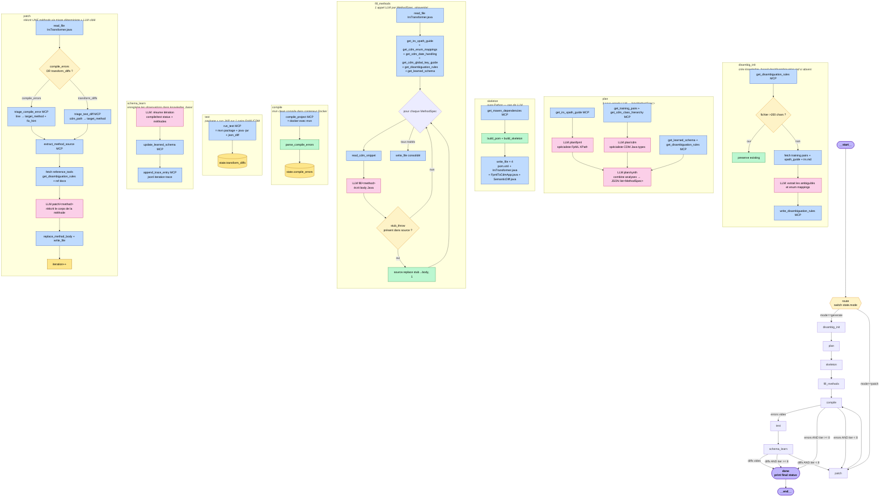

# interface_gen — Agent LangGraph FpML → CDM

Agent autonome qui génère un convertisseur Java FpML 5.x → CDM 6.x. À chaque exécution :
1. Analyse la structure FpML et CDM via deux sous-LLM spécialisés.
2. Planifie une liste de méthodes Java (un *MethodSpec* par concern).
3. Écrit un squelette Maven (`pom.xml`, `IrsTransformer.java`, `FpmlToCdmApp.java`, `SemanticDiff.java`).
4. Demande au LLM de remplir chaque méthode séquentiellement.
5. Compile dans un conteneur Docker, exécute le JAR sur une paire FpML/CDM de test.
6. Si erreurs : triage déterministe → patch ciblé d'une méthode → boucle (8 fois max).

---

## Architecture du graphe d'états



**Légende des couleurs**

| Couleur | Signification |
|---------|---------------|
| 🟣 Violet | Nœud terminal (`__start__`, `done`, `__end__`) |
| 🟡 Jaune | Routage conditionnel |
| 🩷 Rose  | Appel LLM (via `helpers.llm_text_or_raise`) |
| 🔵 Bleu  | Outil MCP (filesystem, triage, validator, mapping) |
| 🟢 Vert  | Code Python pur (pas d'I/O LLM ni MCP) |
| 🟠 Orange| Mutation du `AgentState` |

---

## Comptage des appels LLM (FRA, 11 MethodSpecs)

| Phase | Appels LLM | Notes |
|------|------------|-------|
| `disambig_init` | 1 ou 0 | Skip si `disambiguation.md` existe déjà |
| `plan` | 3 (fpml, cdm, synth) | Sub-appels parallèles puis synthèse |
| `skeleton` | 0 | Pur Python |
| `fill_methods` | N = nb de specs | Séquentiel — `2500 max_tokens` chacun |
| `compile` | 0 | Docker `mvn clean compile` |
| `test` | 0 | Docker `mvn package` + `java -jar` + diff JSON |
| `schema_learn` | 1 | Résumé observations |
| `patch` | 1 par itération | Triage MCP déterministe → réécrit 1 méthode |

**Total typique pour un FRA** : ~16 appels LLM en chemin nominal (sans patch), jusqu'à ~24 si la boucle patch tourne 8 fois.

---

## Backends LLM supportés

Configuré via `LLM_BACKEND` dans `.env`. Chaque backend respecte la même interface `helpers.llm_text_or_raise` (route via OpenAI Async client) :

| Backend | URL | Variable modèle | Notes |
|---------|-----|------------------|-------|
| `gemini` | `https://generativelanguage.googleapis.com/v1beta/openai/` | `GEMINI_MODEL` | Free tier limité : 20 RPD sur 2.5-flash dans certains projets |
| `groq`   | `https://api.groq.com/openai/v1` | `GROQ_MODEL` | Free : ~100k TPD sur llama-3.3-70b, très rapide |
| `ollama` | `http://localhost:11434/v1` | `OLLAMA_MODEL` | Local, illimité ; qwen3 thinking mode désactivé via `/no_think` |
| `vllm`   | `$VLLM_BASE_URL` | `VLLM_MODEL` | Réseau Murex (qwen 27B) |
| `copilot`| GitHub Models | `--model` arg | GH PAT avec scope `models:read` |

Backend par défaut : `ollama` + `qwen3.5:4b` (lent mais sans quota).

Retry automatique avec backoff exponentiel sur 429/503/timeouts (5 tentatives).

---

## Stack MCP (5 serveurs)

| Serveur | Port | Tools exposés |
|---------|------|---------------|
| **filesystem** (supergateway → `@modelcontextprotocol/server-filesystem`) | 8080 | `read_file`, `write_file`, `create_directory`, `list_directory`, … (lecture/écriture sur `workspaces/`, `knowledge_base/`, `data/train`, `data/test`) |
| **triage** (Python FastMCP) | 8002 | `triage_compile_error`, `triage_test_diff` |
| **validator** (Python FastMCP, container Docker) | 8003 | `compile_project`, `run_test`, `run_test_all`, `run_arbitrary_test`, `extract_method_source`, `list_test_suites`, `get_test_cases`, `score_with_llm` |
| **mapping** (Python FastMCP) | 8004 | `get_maven_dependencies`, `ask_human` |
| **tavily** *(optionnel)* | `${TAVILY_MCP}` | Recherche internet pour spec lookups CDM/FpML |

---

## Lancer l'agent (Mac/Linux)

### Pré-requis
- Python 3.13, Node.js + npx, Docker Desktop (pour `validator`)
- `.env` à compléter : choix backend + clé API correspondante

### Setup
```bash
python3 -m venv .venv
.venv/bin/pip install -r requirements.txt

# Démarrer Docker Desktop (le validator a besoin du daemon)
open -a Docker

# Démarrer les 5 serveurs MCP (foreground, Ctrl+C arrête tout)
bash scripts/start_servers.sh
# OU en background :
bash scripts/start_servers.sh > /tmp/mcp.log 2>&1 &
```

### Lancer une exécution
```bash
.venv/bin/python -m agent.graph \
  --fpml      data/test/rates-5-10/fpml/ird-ex08-fra.xml \
  --expected  data/test/rates-5-10/cdm/ird-ex08-fra.json \
  --out       workspaces/test-fra
```

### Arrêter
```bash
bash scripts/start_servers.sh --stop
```

---

## Structure du repo

```
agent/
  graph.py              # LangGraph state machine — 10 nodes
  react_graph.py        # Alternative ReAct loop (non utilisé par graph.py)
  helpers.py            # _llm_text_or_raise, build_pom, build_skeleton, unwrap, …
  llm_call/             # Factory + backends (gemini, groq, ollama, lmstudio, vllm, copilot)
mcp_servers/
  triage_server/        # Pattern matching erreurs compile/test → target method
  validator_server/     # Docker container + mvn compile/package + JSON diff
  mapping_server/       # Maven deps + ask_human
  dev_server/           # Placeholder (supergateway sur workspaces/)
  knowledge_server/     # Placeholder (supergateway sur knowledge_base/)
knowledge_base/
  reference/cdm/        # CDM type hierarchy, enum mappings, date handling
  reference/fpml/       # FpML XPath guides
  rules/                # irs.md, disambiguation.md (corrections humaines)
  knowledge/            # learned_schema, iteration_trace.jsonl, cdm_class_decisions
data/
  train/                # 360+ paires FpML/CDM par famille produit (entraînement)
  test/                 # Paires utilisées par le validator
workspaces/
  test-fra/             # Projet Maven généré par l'agent (overwrite à chaque run)
scripts/
  start_servers.sh      # Démarre les 5 MCP servers (Mac/Linux)
  start_servers.ps1     # Equivalent Windows
  test_llm.py           # Smoke test du backend LLM configuré
configs/
  agent.yaml            # Config vLLM
  mcp.yaml              # URLs des serveurs MCP utilisés par le graph
```
