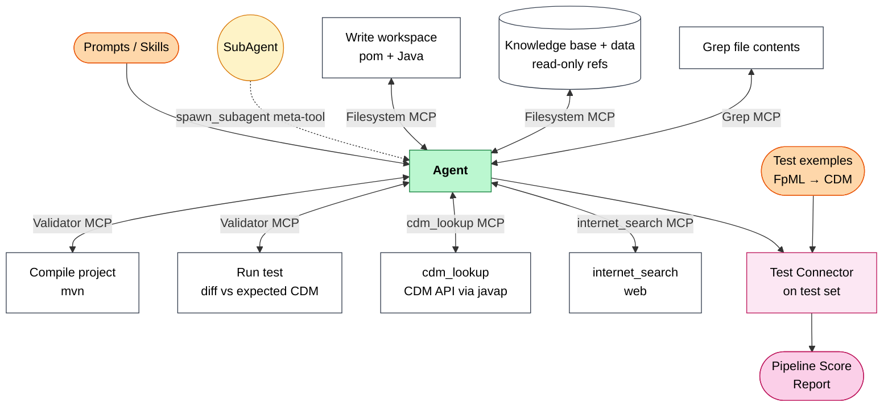
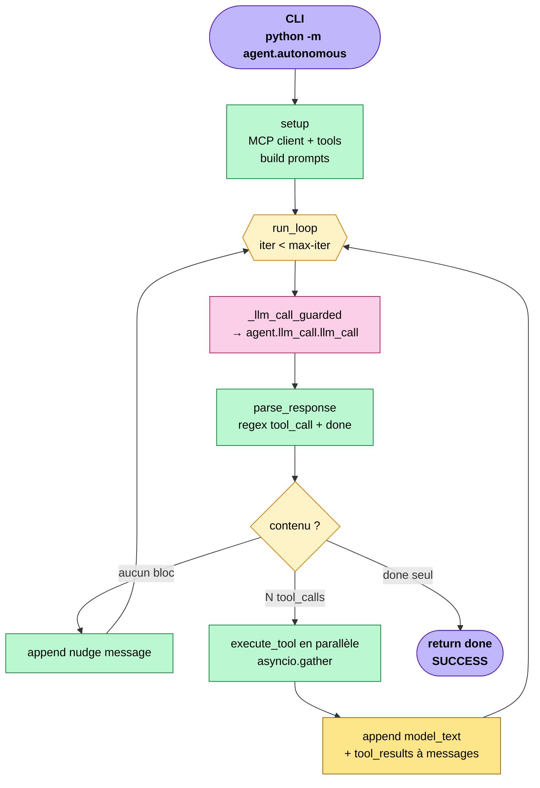
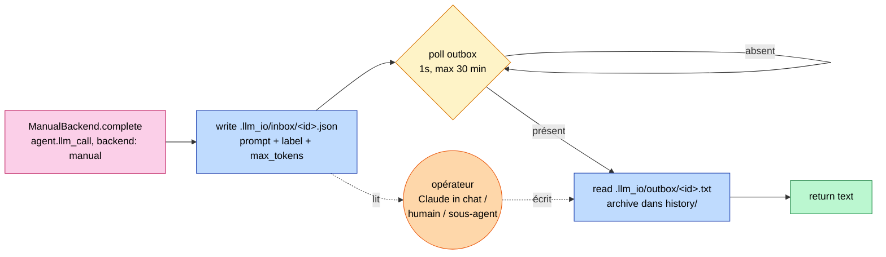

# interface_gen — Agent autonome FpML → CDM

Agent qui génère un convertisseur Java FpML 5.x → CDM 6.x. **Aucun nœud fixe** :
le LLM décide tout — lire les fichiers, écrire le projet Maven, compiler,
tester, patcher — via le tool_use natif (fallback protocole `<tool_call>` XML).
Architecture ReAct simple plus sous-agents parallèles non-récursifs.

Backend par défaut : `qwopus` — **Qwopus3.5-9B-Coder** servi par Ollama sur la
machine GPU du LAN (local, illimité, tool_use natif). Voir le tableau des backends
pour les autres options, dont `manual` (l'« LLM » est Claude répondant dans le chat
via `.llm_io/inbox` ↔ `outbox`). Run prouvé sur `ird-ex08-fra` en `manual` :
**5 itérations → 100 % (92/92)** match avec le JSON CDM de référence.

Entrée : `agent/autonomous.py`. L'ancienne state machine LangGraph nodée
(`graph.py`/`react_graph.py`) a été supprimée — seule la boucle ReAct subsiste.

---

## Architecture

### Vue d'ensemble : capacités de l'Agent + pipeline d'évaluation



L'agent reçoit ses instructions (Prompts/Skills) et peut se déléguer via
le meta-tool SubAgent. Les capacités sont toutes médiées par des MCP
servers — bidirectionnel parce que chaque outil produit un retour
(`<tool_result>`) que l'agent lit. Le bloc inférieur (Test Connector →
Pipeline Score Report) est le runner batch hors-agent qui mesure le
pass-rate sur le test set.

### Boucle ReAct principale (`agent/autonomous.py`)



Le LLM décide quand s'arrêter en émettant `<done>`. Les tool_calls
en parallèle (un par bloc `<tool_call>` dans la réponse) sont dispatchés
vers les MCP servers OU vers le meta-tool `spawn_subagent` qui ré-entre
dans `run_loop` avec `allow_subagents=False` (récursion bornée à 1 niveau).

### Backend `manual` (l'« LLM » = opérateur externe)



**Légende des couleurs** (commune aux deux diagrammes)

| Couleur | Signification |
|---------|---------------|
| 🟣 Violet | Entrée / sortie (CLI, return done) |
| 🟡 Jaune | Routage conditionnel |
| 🩷 Rose  | Appel LLM (`agent.llm_call.llm_call`) |
| 🔵 Bleu  | I/O fichier ou MCP |
| 🟢 Vert  | Code Python pur |
| 🟠 Orange| Mutation de l'état (liste `messages`) |
| 🟧 Or    | Acteur externe (opérateur, meta-tool) |

---

## Protocole tool_call

Chaque tour, le modèle émet un texte qui contient :

```
<tool_call>
{"name": "<tool_name>", "args": { ... }}
</tool_call>
```

- Plusieurs `<tool_call>` blocks dans un tour → exécution **parallèle** via `asyncio.gather`.
- Le host renvoie chaque résultat dans `<tool_result name="..." idx="...">...</tool_result>`.
- Pour clore la boucle : `<done>résumé en 1 phrase</done>`.
- Erreurs : `<tool_result ... error="true">message</tool_result>` — le modèle décide quoi faire.

---

## Itération typique (FRA ird-ex08-fra, run end-to-end)

| Step | Tour Python | Tool calls émis | Sortie |
|------|-------------|------------------|--------|
| 1 | Setup + 1er LLM call | `read_file` (FpML, expected JSON, `knowledge_base/README.md`) | recherche |
| 2 | LLM connaît la cible | `write_file` ×4 (pom + 3 Java) | projet Maven écrit via MCP |
| 3 | Symbole CDM incertain | `cdm_lookup name=...` puis `edit_file` | vraie signature, pas d'hallucination |
| 4 | LLM voit le code prêt | `compile_project` → `run_test` | `ok` → `match`, `score` + diff |
| 5 | LLM voit match=true | `<done>...</done>` | SUCCESS |

L'agent décide le séquencement ; le nombre d'itérations dépend du produit (un FRA simple
converge en quelques tours, un mapping plus riche en prend davantage).

---

## Backends LLM

**Sélectionnés dans [`configs/agent.yaml`](configs/agent.yaml)** (clé `backend:`) — il n'y a
plus de variable `LLM_BACKEND`. Tous passent par `agent.llm_call.llm_call` (façade →
`get_backend()`, mis en cache). Chaque backend est une sous-classe de `LLMBackend`
([`agent/llm_call/`](agent/llm_call/)) : un tronc `OpenAICompatBackend` partagé + des feuilles
à quirk (ex. `OllamaBackend`), et siblings `Anthropic`/`Gemini`/`Manual`. **Ajouter un endpoint
OpenAI-compatible = une entrée YAML (`kind: openai_compat`), zéro code.** Les clés API restent
dans `.env` (référencées par `api_key_env`) ; `*_BASE_URL`/`*_MODEL` y restent surchargeables.

| Backend | URL / mécanisme | Modèle (override `.env`) | Notes |
|---------|------------------|------------------|-------|
| `qwopus` | `$QWOPUS_BASE_URL` (déf. `192.168.1.42:11434/v1`) | `QWOPUS_MODEL` | **Défaut projet.** Qwopus3.5-9B-Coder (Ollama, machine GPU du LAN). Raisonnement : `content` propre + `reasoning` séparé (fallback géré par l'extracteur OpenAI). Tool_use natif OK. Ne PAS forcer `think:false` |
| `ollama` | `$OLLAMA_BASE_URL` (déf. `localhost:11434/v1`) | `OLLAMA_MODEL` | Local, illimité ; Qwen3 → injection `/no_think` (sous-classe `OllamaBackend`) |
| `gemini` | google-genai natif, fallback `/v1beta/openai/` | `GEMINI_MODEL` | Free tier capricieux ; le name `gemini` active le facteur tokens ×1.3 |
| `groq`   | `api.groq.com/openai/v1` | `GROQ_MODEL` | Free : ~100k TPD sur llama-3.3-70b, latence ultra-basse |
| `anthropic` | SDK anthropic (tool_use natif) | `ANTHROPIC_MODEL` | Clé `ANTHROPIC_API_KEY` |
| `openrouter` | `openrouter.ai/api/v1` | `OPENROUTER_MODEL` | Loop dev externe (DeepSeek/Qwen/Devstral…) |
| `vllm`   | `$VLLM_BASE_URL` | `VLLM_MODEL` | Réseau Murex (qwen 27B) ; `enable_thinking:false` via `extra_body` |
| `openai` / `lmstudio` | openai.com / `localhost:1234/v1` | `OPENAI_MODEL` / `LMSTUDIO_MODEL` | OpenAI-compat purs |
| `manual` | `.llm_io/inbox` ↔ `outbox` | — | Pas de LLM. Un opérateur (humain, Claude in chat) répond manuellement (mode XML) |

Retry automatique avec backoff exponentiel (5 retries) sur 429 / 503 / timeouts (`base.with_retry`).

---

## Stack MCP (5 serveurs)

**Chaque capacité est un serveur MCP Python autonome** sous `mcp_servers/` (même pattern
FastMCP streamable-http), démarrés par `bash mcp_servers/start_all.sh`. Détail complet,
tool par tool : [`mcp_servers/README.md`](mcp_servers/README.md).

| Serveur | Port | Tools exposés à l'agent |
|---------|------|--------------------------|
| **filesystem** (`filesystem_server/`, sandbox Python) | 8080 | `read_file`, `read_multiple_files`, `write_file`, `edit_file`, `mkdir_p`, `list_directory` |
| **validator** (`validator_server/`, conteneur Docker maven) | 8003 | `compile_project`, `run_test` (+6 tools batch/diag non exposés) |
| **grep** (`grep_server/`, ripgrep) | 8005 | `grep` — recherche de **contenu** |
| **cdm_lookup** (`cdm_lookup_server/`, introspection `javap`) | 8006 | `cdm_lookup` — vraies signatures builder / constantes d'enum CDM 6.19 |
| **internet_search** (`internet_search_server/`, wrapper Tavily REST) | 8007 | `internet_search` — recherche web (clé `TAVILY_KEY` dans `.env`) |

**Un seul** serveur filesystem : `MultiServerMCPClient` aplatit les tools par nom, donc
un 2e serveur filesystem shadowerait `write_file`/`read_file` et casserait les écritures.
Le filesystem applique un **sandbox 2-niveaux** : lecture sous `workspaces/`+`knowledge_base/`+
`data/`, écriture sous `workspaces/` **uniquement**.

`compact_context` et `spawn_subagent` ne sont **pas** des MCP — ce sont des meta-tools
locaux dans `agent/autonomous.py` : ils manipulent l'état de la boucle (compaction de
l'historique ; ré-entrée dans `run_loop` en partageant LLM/tools/`project_dir`), ce qu'un
serveur MCP ne pourrait pas faire. Tout le reste — y compris `mkdir_p` et `cdm_lookup`,
anciennement locaux — est désormais un vrai MCP.

---

## Lancer l'agent (Mac/Linux)

### Pré-requis
- **Python 3.13** (tous les serveurs MCP sont en Python — plus de dépendance Node/npx)
- **Docker Desktop** (pour `validator` : compile/test dans un conteneur maven)
- **JDK** (`javap`) + `unzip` sur le PATH (pour `cdm_lookup`) ; `rg` (ripgrep) recommandé pour `grep`
- Backend choisi dans `configs/agent.yaml` (clé `backend:`, défaut `qwopus`). Compléter `.env`
  avec la clé API du backend retenu (les locaux qwopus/ollama n'en ont pas besoin), et
  `TAVILY_KEY` si on veut `internet_search`.

### Setup
```bash
python3 -m venv .venv
.venv/bin/pip install -r requirements.txt

# Démarrer Docker Desktop (le validator a besoin du daemon)
open -a Docker

# Démarrer les 5 serveurs MCP locaux (foreground, Ctrl+C arrête tout)
bash mcp_servers/start_all.sh
# OU en background :
bash mcp_servers/start_all.sh > /tmp/mcp.log 2>&1 &
# (scripts/start_servers.sh existe encore et délègue à ce script)
```

### Lancer une exécution
```bash
.venv/bin/python -m agent.autonomous \
  --fpml      data/test/rates-5-10/fpml/ird-ex08-fra.xml \
  --expected  data/test/rates-5-10/cdm/ird-ex08-fra.json \
  --out       workspaces/test-fra-autonomous \
  --max-iter  60
```

### Répondre aux prompts en mode `manual`
Avec `backend: manual` dans `configs/agent.yaml`, l'agent attend qu'un opérateur dépose la réponse :

```bash
# Voir la requête en cours
ls .llm_io/inbox/

# Helper qui JSON-échappe un fichier dans un <tool_call>{"name":"write_file",...}</tool_call>
python scripts/emit_write_call.py \
  /tmp/source.java /chemin/absolu/cible.java \
  > .llm_io/outbox/<même-id>.txt

# Pour clore : écrire <done>...</done> dans .llm_io/outbox/<id>.txt
```

### Arrêter
```bash
bash mcp_servers/start_all.sh --stop
```

---

## Structure du repo

```
agent/
  autonomous.py         # ★ Agent autonome — ReAct loop + tool_call + sub-agents + timeouts
  run_logger.py         # Observabilité — run.log (humain) + run_summary.json (par run)
  protocol.py           # Types neutres (LLMResponse/ToolCall) + conversion wire (messages/tools/extracteurs)
  context.py            # Estimation tokens + compaction auto/manuelle
  helpers.py            # MCP server config (get_servers) + unwrap des résultats d'outils
  llm_call/             # Backends LLM config-driven : base.py (LLMBackend + with_retry),
                        #   openai_compat/ollama/anthropic/gemini/manual, config.py + __init__ (get_backend, llm_call)
mcp_servers/            # un serveur MCP Python par capacité — voir mcp_servers/README.md
  start_all.sh          # ★ Démarre les 5 serveurs locaux (Mac/Linux)
  README.md             # Doc détaillée, tool par tool
  filesystem_server/    # read/write/edit/mkdir_p/list — sandbox (read refs, write workspaces)
  validator_server/     # Docker maven : compile_project / run_test (+harnais batch/diag)
  grep_server/          # ripgrep — recherche de contenu
  cdm_lookup_server/    # introspection CDM 6.19 via javap (signatures builder / enums)
  internet_search_server/  # recherche web (wrapper Tavily REST)
  dev_server/ exemple_server/ knowledge_server/  # notes de design (pas des serveurs)
knowledge_base/         # PROSE uniquement (aucun .java pré-écrit ; signatures via cdm_lookup)
  README.md             # ★ index routeur « pour faire X, lis Y » (lu en premier par l'agent)
  cdm/                  # modèle cible : object-model, builder-conventions, meta-and-references,
                        #   dates, enums, pitfalls + structure-skeleton.json (carte JSON null),
                        #   rosetta/ (DSL vérité-terrain), hierarchy.txt
  fpml/                 # modèle source : document-structure + 1 fichier par famille produit
  mapping/              # le pont FpML→CDM : principles + 1 field-map par famille (rates approfondi)
  build/                # dependencies.md (coordonnées Maven)
  policies/             # cdm_structure.rego ; notes/ : mémoire de travail de l'agent
data/
  train/                # 360+ paires FpML/CDM par famille produit
  test/                 # Paires utilisées par le validator (data/test/ monté dans le Docker)
workspaces/
  <run>/                # Projet Maven généré + run.log + run_summary.json + trace.jsonl (gitignored)
scripts/
  start_servers.sh      # Délègue à mcp_servers/start_all.sh (rétro-compat)
  start_servers.ps1     # Lance les 5 serveurs MCP Python (Windows)
  test_llm.py           # Smoke test du backend agent.yaml (chemin réel agent.llm_call.llm_call)
  emit_write_call.py    # Helper : fichier disque → <tool_call> write_file JSON-échappé (mode manual)
  visualize_data.py     # Viewer côte-à-côte d'une paire FpML/CDM (debug)
  llm_crash_test.py     # Stress-test d'un endpoint LLM sur du contexte réel (sans timeout)
configs/
  agent.yaml            # ★ Sélection + config des backends LLM (backend:, backends:, defaults:)
  mcp.yaml              # URLs des 5 MCP (skip auto si ${VAR} non résolue)
.llm_io/
  inbox/                # Prompts émis par l'agent (mode manual) — JSON
  outbox/               # Réponses de l'opérateur — texte (1 fichier par id)
  history/              # Archive append-only des paires req+resp
```
